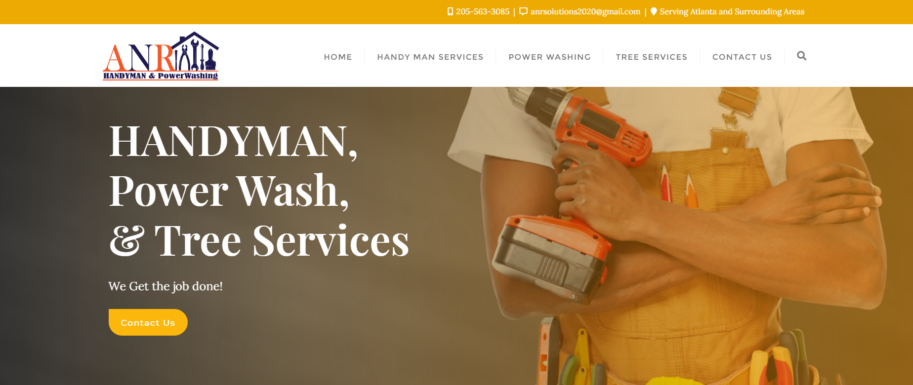
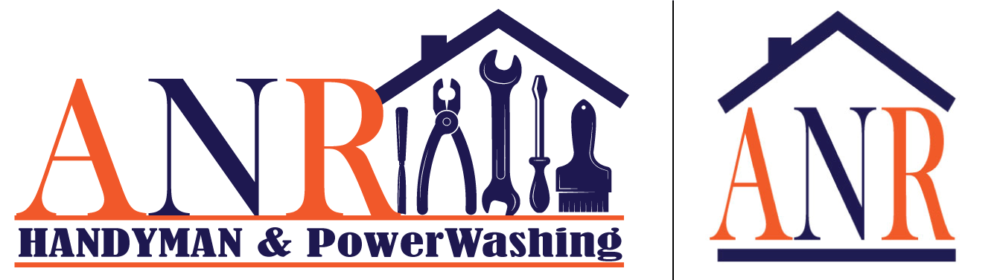
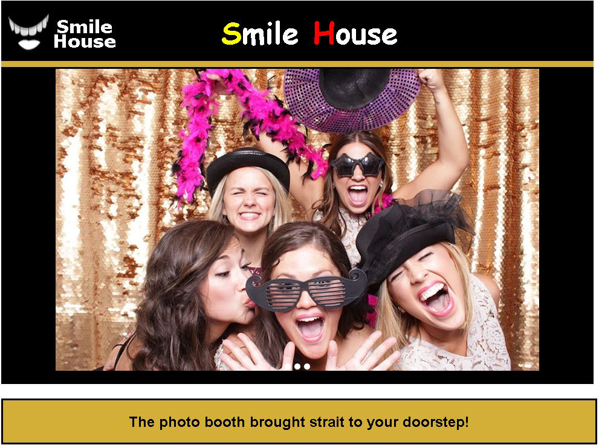

# Portfolio
---
## WordPress Projects that I have created or contributed to
---
### Handyman Website
A website for a handyman that I build utilizing a repurposed premade design.
[Handyman Website Website](http://anrsolutionsservices.com/)

---
### Real Estate Agent Website
This is a project that I've contributed to. The homepage design as well as font and animation descicions were made by me. 
[Real Estate Agent Website](https://paulabarrett.net/)

---

## Examples of Logos that I have Created

---

## Projects I've created using HTML, CSS, & JavaScript/JQuery

---

### Flavor Music Websight Redesign 
This is my most recent work in progress. It is redesign of a live entertainment
band called Flavor Music. Presently, there are only five working pages:
* Home 
* About 
* Songlist 
* FAQ 
* Contact

[Flavor Music Redesign ](/flavor/index.html)

---
### Photographer Portfolio

A portfolio design for a photographer utilizing HTML5, CSS, & Jquery.

[Photographer Portfolio](/portfolio/index.html)

---
### Product Landing Page

A simple Product Landing Page using only HTML5 and CSS.

[Product Landing Page](/ProductLanding/ProductLandingPage.html)

---

<!-- Remove above link if you don't want to attibute -->
